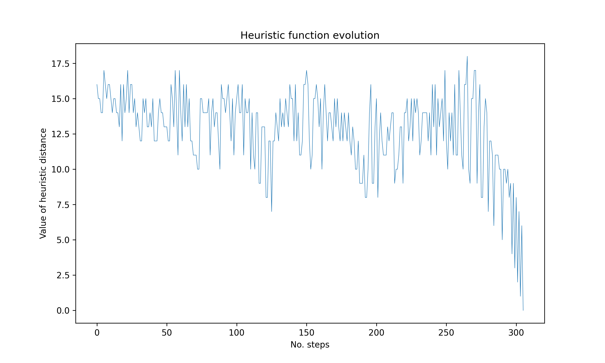

# N-Puzzle solver
The N-Puzzle is a sliding puzzle consisting of n numbered tiles and an empty space that challenges the player to move pieces along certain routes in order to establish a specific end-configuration (usually in ascending numerical order). 8-puzzle consists of 8 tiles in a 3x3 frame, [15-puzzle](https://en.wikipedia.org/wiki/15_puzzle) has 15 tiles in a 4x4 frame etc.

## This program solves n-puzzle using A* algorithm with various heuristics.

## Heuristics
- `Hamming Distance / Misplaced Tiles`: the number of tiles that are not in the correct position. This heuristic is the simplest, but also the slowest. A huge amount of states will be explored in order to reach the goal state;
- `Manhattan Distance / Taxicab Geometry`: the Manhattan distance of a tile is the distance or the number of tiles away it is from its target position. It is calculated as the sum of the absolute differences between its current row and column and its target row and column. For a certain puzzle configuration, the Manhattan distance is the sum of the Manhattan distances of all the tiles, except the blank tile;
- `Linear Conflict + Manhattan Distance / Taxicab Geometry`: two tiles *tile_a* and *tile_b* are in linear conflict if they are both in their correct row or column, but they are reversed relative to their goal positions. They are in the same row or column, their target positions are in the same row or column and the target position of one of the tiles is occupied by the other tile in that row or column. The heuristic value is Manhattan Distance + 2 * number of linear conflicts.

## 8-Puzzle Example
Starting from a given initial configuration, obtained by randomly moving the tiles for 1_000 steps, a path like the following is obtained. The implemented algorithm is particularly efficient. It obtains the solution in just 23 moves in a particularly short time, in the order of one second. The first state in the path is the *initial_state*. The last state is the *goal_state*.
> Given the small size of the path required to solve the 8-puzzle problem, it was decided to report this case in the README. The 4x4 puzzle has instead been resolved in the code.
```python
[
    array([[7, 3, 4],
       [2, 0, 5],
       [1, 6, 8]]), 
    array([[7, 3, 4],
       [2, 6, 5],
       [1, 0, 8]]), 
    array([[7, 3, 4],
       [2, 6, 5],
       [1, 8, 0]]), 
    array([[7, 3, 4],
       [2, 6, 0],
       [1, 8, 5]]), 
    array([[7, 3, 0],
       [2, 6, 4],
       [1, 8, 5]]), 
    array([[7, 0, 3],
       [2, 6, 4],
       [1, 8, 5]]), 
    array([[0, 7, 3],
       [2, 6, 4],
       [1, 8, 5]]), 
    array([[2, 7, 3],
       [0, 6, 4],
       [1, 8, 5]]), 
    array([[2, 7, 3],
       [1, 6, 4],
       [0, 8, 5]]), 
    array([[2, 7, 3],
       [1, 6, 4],
       [8, 0, 5]]), 
    array([[2, 7, 3],
       [1, 0, 4],
       [8, 6, 5]]), 
    array([[2, 0, 3],
       [1, 7, 4],
       [8, 6, 5]]), 
    array([[0, 2, 3],
       [1, 7, 4],
       [8, 6, 5]]), 
    array([[1, 2, 3],
       [0, 7, 4],
       [8, 6, 5]]), 
    array([[1, 2, 3],
       [7, 0, 4],
       [8, 6, 5]]), 
    array([[1, 2, 3],
       [7, 4, 0],
       [8, 6, 5]]), 
    array([[1, 2, 3],
       [7, 4, 5],
       [8, 6, 0]]), 
    array([[1, 2, 3],
       [7, 4, 5],
       [8, 0, 6]]), 
    array([[1, 2, 3],
       [7, 4, 5],
       [0, 8, 6]]), 
    array([[1, 2, 3],
       [0, 4, 5],
       [7, 8, 6]]), 
    array([[1, 2, 3],
       [4, 0, 5],
       [7, 8, 6]]), 
    array([[1, 2, 3],
       [4, 5, 0],
       [7, 8, 6]]), 
    array([[1, 2, 3],
       [4, 5, 6],
       [7, 8, 0]])
]

# Printing results
Solve 8-puzzle in 23 moves
306 evaluated actions
```

## Results
The following graphs show the evolution of the **heuristic function**, in term of `h_distance`, used in the A* algorithm during the search process to solve the n-puzzle problem. The x-axis represents the number of steps taken by the algorithm, while the y-axis represents the value of the heuristic function at each step. It is possible to observe that the heuristic function fluctuates as the algorithm explores different states. Initially, the heuristic value tends to be higher as the algorithm is far from the goal. Then it tends to decrease, reflecting the reduced distance to the goal state. It is equal to 0 after 306 actions.



## Contributions 
If you have any advice and you want to contribute to this project, don't hesitate to open an issue, fork the repository and submit a pull request.

## Contact
For questions, contact me at agnesere43@gmail.com.

